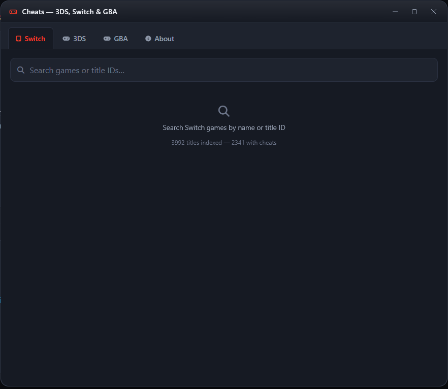

# Nintendo Cheats — 3DS · Switch · GBA

A tiny, fast, dependency-free web app for browsing cheat codes for
**Nintendo 3DS**, **Nintendo Switch** and **Game Boy Advance** titles.

Everything runs in the browser — no accounts, no tracking, no backend.
Type a game name (or a title ID), pick a cheat, hit **Copy**, done.

  

---

## Features

- **Instant fuzzy search** across game names, title IDs and publishers
- **Three platforms in one window** — Switch, 3DS and GBA, each with its own tab
- **Draggable, resizable, minimizable** Windows-style panel
- **Light & dark themes** — remembers your choice via `localStorage`
- **One-click Copy** for every cheat block (Clipboard API + `execCommand` fallback)
- **Rich metadata** for Switch / 3DS titles via the [NLib](https://api.nlib.cc/) API
- **Zero backend** — 100 % static, deployable to GitHub Pages, Netlify, Vercel, ...

## Using it

1. Click Show Menu in the navbar (or the Open the Cheats Menu button on the home page).
2. Pick the Switch, 3DS or GBA tab.
3. Start typing a game name — the list filters instantly.
4. Click a game to see all its cheats.
5. Hit Copy next to any cheat.

> On Switch / 3DS you can also search by the 16-character title ID
> (e.g. ``010099B00A2DC000``).

## Data sources
| Plataform | Cheat Codes | Metadata |
|-----------|-------------|-----------|
| Switch | [Sharkive](https://github.com/FlagBrew/Sharkive) (fallback: [blawar/titledb](https://github.com/blawar/titledb)) | [NLib API](https://api.nlib.cc/) |
| 3DS | [Sharkive](https://github.com/FlagBrew/Sharkive) | [NLib API](https://api.nlib.cc/) + [3DSDB](https://github.com/ghost-land/3dsdb) |
| GBA | [RetroArch / libretro-database](https://www.libretro.com/) (community-aggregated) | --- |

*All data is fetched client-side. Nothing is uploaded anywhere.*

## Credits

- **[Sharkive](https://github.com/FlagBrew/Sharkive)** — the 3DS & Switch cheat database, maintained by [FlagBrew](https://github.com/FlagBrew)
- **[RetroArch / libretro-database](https://www.libretro.com/)** — GBA cheat codes, community-aggregated
- **[NLib API](https://api.nlib.cc/)** — game metadata for Switch & 3DS
- **[3DSDB](https://github.com/ghost-land/3dsdb)** — fallback 3DS metadata
- **[Bootstrap 5](https://getbootstrap.com/)** — grid & utility CSS
- **[Font Awesome](https://fontawesome.com/)** — icons
- **[MrJuaumBR](https://github.com/MrJuaumBR)** — contributor & maintainer

# Disclaimer

This project is not affiliated with Nintendo in any way.

Cheat codes are provided as-is, for use with modded consoles or emulators.
Using cheats may violate the terms of service of some platforms, and can
corrupt save data if misused. Always back up your saves. Use at your
own risk.